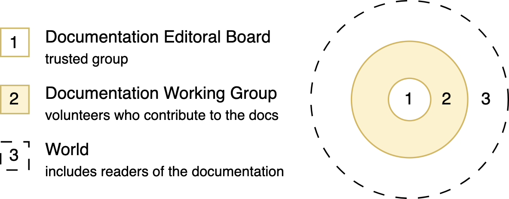

# Python Documentation Community

[](https://docs-community.readthedocs.io/?badge=latest)
[](https://discuss.python.org/c/documentation/26)

<picture>
  <source media="(prefers-color-scheme: dark)" srcset="pep732-circles-dark.png">
  <source media="(prefers-color-scheme: light)" srcset="pep732-circles-light.png">
  
</picture>

1. Editorial Board (Approved in 2023 by Steering Council and described in
   [PEP 732](https://peps.python.org/pep-0732/))<br>
   Referred to as Editorial Board or EB<br>
   Repo: [python/editorial-board](https://github.com/python/editorial-board)
2. Documentation Community Group (Working Group created in 2021 by the Python
   Steering Council)<br>
   Referred to as the Documentation Community or docs-community<br>
   Repo: [python/docs-community](https://github.com/python/docs-community)
3. Users of Python Documentation

This repo serves as documentation for the Documentation Community Group.

For example, to find out more about us and what we do, [read the docs](https://docs-community.readthedocs.io/).

## Build docs and view changes

1. Clone this repo

   ```console
   git clone https://github.com/python/docs-community.git
   cd docs-community
   ```

2. Create a new Python virtual environment

   ```console
   make venv
   ```

3. Build the docs, open them in your browser and update whenever changes are made

   ```console
   make htmllive
   ```
